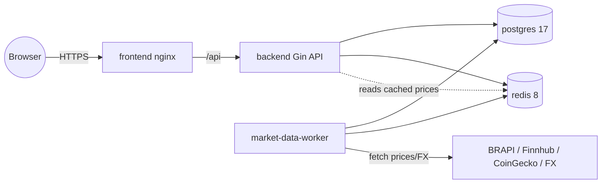

# Project Plan — Personal Investment Portfolio Manager

Root-level plan that ties together the [backend](backend/PLAN.md) and
[frontend](frontend/PLAN.md) plans and defines the infrastructure, container
wiring, and cross-cutting concerns from [`SPEC.md`](SPEC.md) §3, §14, §16.

---

## 1. Repository Layout

```
finance/
  SPEC.md
  PLAN.md                 # this file
  README.md               # top-level setup + run
  docker-compose.yml
  docker-compose.override.yml   # local dev (hot reload, exposed ports)
  .env.example            # root compose vars (placeholders only)
  .gitignore              # already covers .env, *.key, *.pem, data dirs
  backend/                # Go API + worker (see backend/PLAN.md)
  frontend/               # React/Vite app (see frontend/PLAN.md)
```

The `market-data-worker` ships from the `backend/` image (shared Go module,
`cmd/worker` entrypoint) rather than a separate top-level `worker/` directory.

---

## 2. Service Topology



- **frontend** — nginx serving the built SPA; reverse-proxies `/api` to backend;
  sets strict CSP/security headers. Only the frontend is publicly exposed.
- **backend** — Gin REST API; owns auth, CRUD, portfolio calculations; reads
  latest prices/FX from Redis (written by worker), falls back to DB.
- **market-data-worker** — scheduled price/FX sync (SPEC §12); the only service
  holding third-party API keys alongside the backend.
- **postgres 17** — source of truth; named volume `postgres-data`.
- **redis 8** — latest-price/FX cache + in-flight fetch dedupe; optional, enabled
  via flag.

---

## 3. Docker Compose Wiring (SPEC §14)

Refines the SPEC skeleton:

- **frontend:** `build: ./frontend`, depends_on backend, exposes `:5173` (dev) /
  `:80` (prod), `VITE_API_BASE_URL` build arg.
- **backend:** `build: ./backend`, target `api`, `depends_on` postgres (healthy)
  + redis, reads env from `backend/.env`, runs migrations on start (or via a
  one-shot `migrate` profile).
- **market-data-worker:** `build: ./backend` with `command` overriding to the
  worker entrypoint; same env; `depends_on` postgres + redis.
- **postgres:** `image: postgres:17`, healthcheck (`pg_isready`), named volume,
  init only via app migrations (no ad-hoc SQL in compose).
- **redis:** `image: redis:8`, healthcheck, `--appendonly yes`, named volume.
- **Networks:** single internal bridge network; only `frontend` publishes a host
  port. Backend/worker/db/redis are internal-only.
- **No secrets in compose** — all via env files; `.env` git-ignored.
- Pin images by digest where practical (`13-infrastructure` rule); non-root
  users in final image stages; multi-stage builds.

---

## 4. Cross-Cutting Concerns

- **Environment & secrets:** each service has its own `.env.example`; a root
  `.env.example` holds compose-level vars (ports, `POSTGRES_*`, `REDIS_URL`).
  Real `.env` files never committed. Postgres credentials and JWT secret
  generated locally, not shared in repo.
- **Database:** single Postgres instance; backend owns the schema via
  `golang-migrate`; least-privilege app role distinct from the migration role.
- **Currency & money:** decimal precision end-to-end; original transaction
  values immutable; conversion computed at read time.
- **Observability:** structured JSON logs from backend + worker with
  secret/PII redaction; opaque request IDs propagated frontend → backend.
- **Security review:** auth, crypto, and any newly public surface flagged for
  human review (`20-human-review`); threat-model note for external provider
  integrations (`21-threat-modeling`).

---

## 5. Documentation

- Root `README.md`: one-command local bring-up (`docker compose up`), prereqs,
  env setup, how to run migrations, links to backend/frontend plans + READMEs.
- Architecture diagram (above) kept current with compose changes.

---

## 6. Build & Run Order (MVP, SPEC §16)

1. Scaffold repo: root compose, `.env.example` files, both Dockerfiles, READMEs.
2. Stand up **postgres + redis**; verify healthchecks.
3. Build **backend** (per backend plan phases 1–6) against compose DB.
4. Wire **market-data-worker** (backend plan phase 7) for prices + FX.
5. Build **frontend** (per frontend plan phases) against the running backend.
6. **Hardening:** CSP/headers, rate limiting, coverage gates, OpenAPI, security
   review, end-to-end smoke via compose.

Success criterion (SPEC §16): a user registers buys/sells, views holdings,
tracks profitability, and monitors portfolio evolution across B3 and NASDAQ from
a single dashboard — all running via `docker compose up`.

---

## 7. Open Questions / Assumptions

- Worker built from the `backend/` image (shared module) — confirm vs. separate
  `worker/` directory in the SPEC's compose snippet.
- Redis treated as optional-but-default-on for caching.
- Only the frontend container is publicly exposed; everything else internal.
