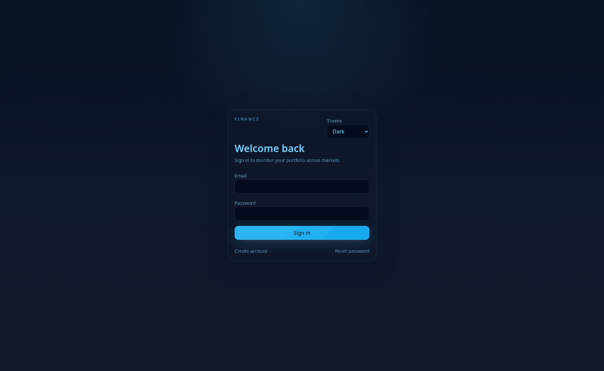

# Personal Investment Portfolio Manager

A full-stack portfolio tracker for B3, NASDAQ, and crypto assets.

## Quick Walkthrough



## Stack

- `frontend/`: React + TypeScript + Vite + TanStack Query + Recharts
- `backend/`: Go + Gin + PostgreSQL + JWT auth
- `postgres`: persistent relational storage
- `redis`: cache for background price-sync workflows
- `market-data-worker`: background job runner

## Security Notes

- Copy `.env.example` to `.env` and replace the placeholder JWT secret before sharing or deploying.
- Real secrets must stay in local `.env` files only. Do not commit them.
- Frontend env vars must be `VITE_*` and non-secret only.
- Provider API keys belong on the backend only.

## Run With Docker Compose

1. Copy the root env file:

```bash
cp .env.example .env
```

2. Start the full stack:

```bash
docker compose up --build -d
```

3. Open the app:

- Frontend: [http://localhost:8081](http://localhost:8081)

4. Stop the stack:

```bash
docker compose down
```

If you also want to remove local Postgres/Redis volumes:

```bash
docker compose down -v
```

## Run Locally Without Docker

### Backend

From `backend/`:

```bash
cp .env.example .env
make migrate-up
make run-api
```

In another shell, start the worker:

```bash
make run-worker
```

### Frontend

From `frontend/`:

```bash
cp .env.example .env
npm install
npm run dev
```

The Vite dev server runs at [http://localhost:5173](http://localhost:5173).

## Test Commands

### Backend

```bash
cd backend
go test ./...
```

### Frontend

```bash
cd frontend
npm run test
npm run typecheck
npm run build
```

## What’s Implemented

- Register, login, logout, and password reset flow
- User display names for a friendlier in-app welcome
- Asset listing
- Transaction CRUD
- Dividend CRUD
- Portfolio summary, positions, and performance views
- Live market data sync for B3, U.S. equities, crypto, and USD/BRL FX
- Asset detail icons with backend-proxied provider images and safe fallbacks
- Dashboard charts and reports
- Dockerized frontend, backend, worker, Postgres, and Redis
- CSP and security headers on the frontend nginx layer
- Frontend session persistence with expiration across page reloads

## Current Limitations

- Some asset icons still depend on third-party provider coverage, so uncommon symbols may fall back to initials.
- U.S. equity market data and logos rely on public upstream endpoints, which are more fragile than dedicated commercial feeds.
- The backend auth/crypto surface should still receive human security review before production use.
