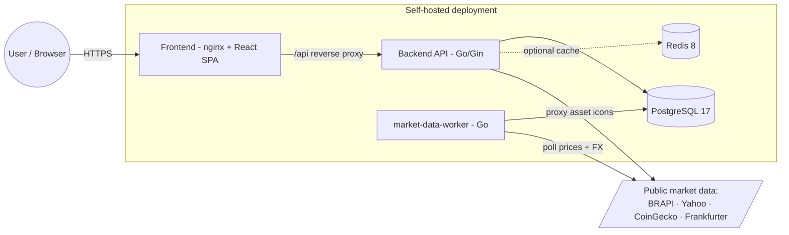
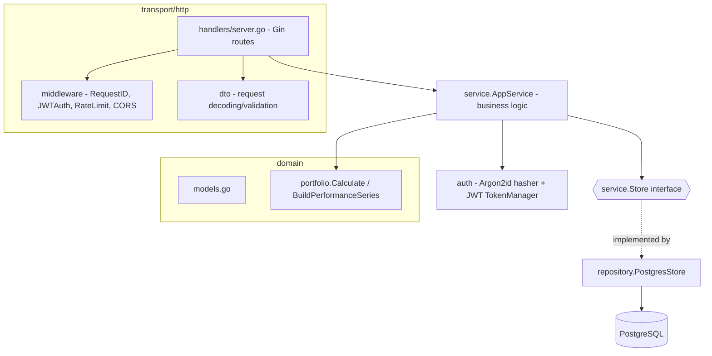
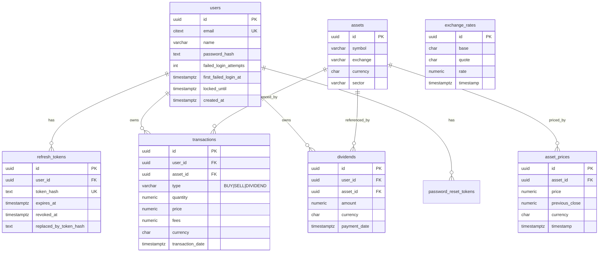
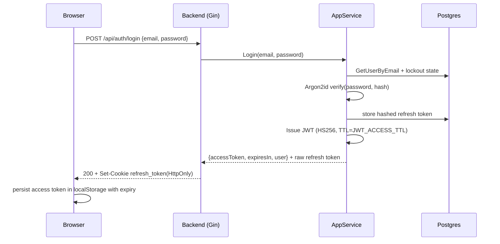
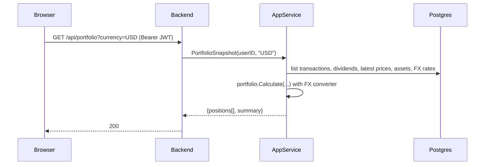
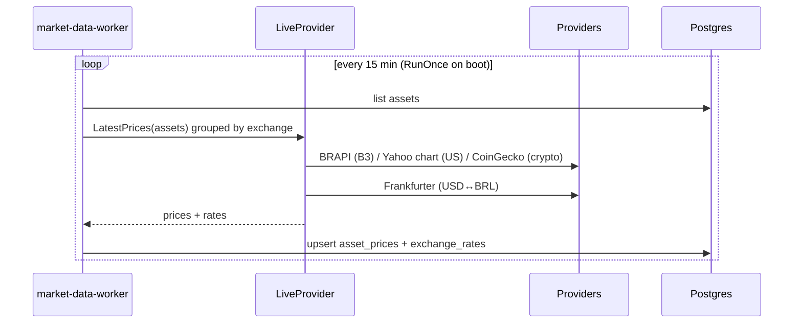

# Architecture — Personal Investment Portfolio Manager

> Status: Living document · Audience: engineers, reviewers, operators · Scope: MVP (SPEC §16) as currently implemented.

This document describes the architecture of the Personal Investment Portfolio
Manager: a self-hosted web application that consolidates personal investments
across B3 (Brazil), NASDAQ/NYSE (US) and crypto, tracks cost basis and
profit/loss, and renders a finance dashboard. It is grounded in the current
codebase, not just the original [`SPEC.md`](../SPEC.md), and calls out where the
implementation deviates from the spec.

---

## 1. Goals and non-goals

### Goals (from SPEC §2)

- Track buys, sells and dividends across multiple exchanges and currencies.
- Compute average cost, realized and unrealized P/L, portfolio value and daily
  performance.
- Automatically fetch live prices and FX rates from public providers.
- Present a responsive, modern, dark-first dashboard with charts.
- Ship as a single `docker compose up`, secure-by-default deployment.

### Non-goals (current MVP)

- Multi-user collaboration / sharing (each user owns their own data only).
- Brokerage CSV import, tax reports, alerts, watchlists (SPEC §15 — future).
- Tick-level / intraday streaming data (prices are polled, not streamed).
- Horizontal scale-out; the design targets a single-node self-hosted install.

---

## 2. Architectural principles

1. **Layered, dependency-inverted backend.** HTTP → service → repository →
   database. Inner layers know nothing about transport. The service depends on a
   `Store` interface, not a concrete Postgres type, which keeps business logic
   testable with mocks.
2. **Money is never a float in business logic.** All monetary and quantity math
   uses `shopspring/decimal` end-to-end and `NUMERIC(20,8)` in Postgres.
3. **Original transaction values are immutable.** Currency conversion is applied
   at read time against the latest FX rate; the stored transaction keeps its
   original currency and amount (SPEC §8).
4. **Secure by default.** Argon2id hashing, short-lived JWTs, DB-backed refresh
   tokens in HttpOnly cookies, account lockout, strict CSP, CORS allowlist,
   TLS-required DB outside dev, and no third-party secrets on the client. See
   [§9 Security](#9-security-architecture).
5. **External data is untrusted and isolated.** Third-party market-data and icon
   fetches happen only on the backend/worker; the browser never talks to a
   provider directly and never holds provider API keys.
6. **Single source of truth.** Postgres is authoritative. Redis is an optional
   cache. The frontend holds only ephemeral/session state.

---

## 3. System context

Only the **frontend** container publishes a host port. The backend, worker,
Postgres and Redis live on an internal Docker network.

---

## 4. Container / service topology

Defined in [`docker-compose.yml`](../docker-compose.yml). All three Go binaries
(`api`, `worker`, `migrate`) are built from a single multi-stage
[`backend/Dockerfile`](../backend/Dockerfile) and shipped as distroless,
non-root images.

| Service | Image / build target | Responsibility | Exposed |
|---|---|---|---|
| `frontend` | `./frontend` (nginx) | Serve built SPA, reverse-proxy `/api`, set CSP/security headers | `:${FRONTEND_PORT:-8081}` → `80` |
| `backend` | `./backend` target `api` | REST API: auth, CRUD, portfolio calc, icon proxy | internal `:8080` |
| `market-data-worker` | `./backend` target `worker` | Scheduled price + FX sync | internal |
| `migrate` | `./backend` target `migrate` | One-shot schema migration on boot | internal |
| `postgres` | `postgres:17` | System of record (volume `postgres-data`) | internal `:5432` |
| `redis` | `redis:8` | Optional latest-price/FX cache (volume `redis-data`) | internal `:6379` |

**Startup ordering** is enforced by healthchecks and `depends_on`: `postgres`
(healthy) → `migrate` (completes) → `backend` + `market-data-worker`, then
`frontend`.

---

## 5. Backend architecture

A clean, layered Go module (`github.com/thiago/finance/backend`).

### 5.1 Package responsibilities

- **`cmd/api`, `cmd/worker`, `cmd/migrate`** — three entrypoints, one module.
- **`internal/config`** — env-driven config (`caarlos0/env` + `godotenv`).
  Validates `JWT_SECRET ≥ 32 chars`, requires `DATABASE_URL`, and enforces
  `sslmode=require|verify` outside development.
- **`internal/transport/http`** — Gin router, handlers, DTOs and middleware.
  Handlers are thin: decode → call service → map errors to HTTP codes.
- **`internal/service`** — the application core. Owns validation, normalization
  (uppercase symbols/currencies, lowercase emails, trim names), orchestration,
  and the read-time assembly of a portfolio snapshot. Depends only on the
  `Store` interface and the `auth` primitives.
- **`internal/domain`** — pure types (`User`, `Asset`, `Transaction`,
  `Dividend`, `AssetPrice`, `ExchangeRate`) and the `portfolio` calculator. No
  I/O, fully unit-testable.
- **`internal/repository`** — `PostgresStore`, the concrete `Store`
  implementation over `pgx`, using parameterized queries only.
- **`internal/auth`** — Argon2id password hashing, JWT issuance/verification and
  opaque refresh-token helpers.
- **`internal/marketdata`** — `Provider` (live price/FX) and `IconResolver`
  (icon proxy). The only place that talks to third parties.
- **`internal/jobs`** — `PriceSyncJob`, the scheduled sync loop used by the
  worker.

### 5.2 Error handling

The service exposes sentinel errors (`ErrInvalidInput`, `ErrInvalidCredentials`)
and the repository exposes `ErrNotFound`. The transport layer's `writeError`
maps these to `400 / 401 / 404`, defaulting unknown errors to a generic `500`
with no internal detail leaked to the client. Errors are returned as
`{ "error": { "code", "message" } }`.

---

## 6. Frontend architecture

React 18 + TypeScript SPA built with Vite, served statically by nginx.

- **Routing** ([`app/router.tsx`](../frontend/src/app/router.tsx)) — `react-router`
  with a `ProtectedLayout` (requires a token, else redirect to `/login`) and a
  `PublicOnly` wrapper for auth pages. Protected routes render inside `AppShell`:
  Dashboard, Portfolio, Asset details, Transactions, Reports, Settings.
- **Server state** — TanStack Query hooks under `features/*/hooks.ts`, all going
  through a single typed API client ([`lib/api/client.ts`](../frontend/src/lib/api/client.ts)).
The client injects the bearer token, normalizes list responses (`data: null →
  []`), attempts a one-time `/api/auth/refresh` on `401`, retries the original
  request once, and clears the session if refresh fails.
- **Client/session state** — Zustand store
  ([`features/auth/store.ts`](../frontend/src/features/auth/store.ts)) holds
  the short-lived access token, user, theme (`dark | light | neon`) and
  preferred currency. The access-token session is **persisted to `localStorage`
  with an explicit expiry**; the longer-lived refresh token lives only in a
  secure HttpOnly cookie and is never exposed to JavaScript.
- **Presentation** — TailwindCSS with CSS-variable theming, `shadcn/ui`-style
  primitives, Recharts for allocation/performance charts.
- **Forms** — React Hook Form + Zod. Currency is a constrained dropdown
  (USD/BRL) with autofill from the selected asset.

> Note: per SPEC the dashboard summary cards use `GET /api/portfolio` (full
> snapshot) — `summary` and `performance` endpoints exist and are used where a
> lighter payload is preferred.

---

## 7. Data model

Schema is owned by the backend via `golang-migrate`
([`backend/internal/db/migrations`](../backend/internal/db/migrations)). Money
and quantities are `NUMERIC(20,8)`; emails use `CITEXT`; `updated_at` is
maintained by triggers.

Key constraints: `assets(symbol, exchange)` unique; `transactions.type` CHECK in
`('BUY','SELL','DIVIDEND')`; `transactions.asset_id` is `ON DELETE RESTRICT`
(assets cannot be deleted out from under positions); user-owned rows cascade on
user delete. Indexes support the hot read paths
(`transactions(user_id, transaction_date DESC)`,
`asset_prices(asset_id, timestamp DESC)`).

> Deviation from SPEC §10: the implementation adds `users.name`, user auth-state
> lockout columns, `asset_prices.previous_close` (for daily-change calc), and
> the `exchange_rates`, `password_reset_tokens`, and `refresh_tokens` tables
> beyond the spec's column lists.

---

## 8. Key flows

### 8.1 Authentication

Auth endpoints are rate-limited (`5 requests / 10s`). The access token TTL
(default 15m) drives the client-side session expiry; `/api/auth/refresh`
rotates the DB-backed refresh token and issues a new access token when the old
one expires. After 5 failed logins within 15 minutes, the account is locked for
15 minutes.

### 8.2 Portfolio snapshot (read path)

`portfolio.Calculate` **sorts transactions chronologically** (by
`transaction_date`, then `created_at`) before replaying them — this fixed a
real bug where DB-descending order caused spurious "oversell" errors and 500s.
It then computes per-position average cost, realized/unrealized P/L, daily
change vs. previous close, and rolls them into a summary, converting every
amount into the requested currency at read time.

### 8.3 Scheduled price sync (worker)

> Deviation from SPEC §12: a single 15-minute ticker is used rather than the
> 1-minute/15-minute market-hours split. Portfolio "recalculation" is done
> on-read in `Calculate` rather than as a materialized background job.

---

## 9. Security architecture

Aligned with the workspace security rule pack.

- **Passwords** — Argon2id (`auth/password.go`), parameters from config
  (`ARGON2_*`), never stored or logged in plaintext.
- **Tokens** — JWT issued/verified in `auth/jwt.go`; `JWT_SECRET` must be ≥ 32
  chars (validated at boot). Stateless `Bearer` auth via `JWTAuth` middleware
  plus DB-backed, hashed refresh tokens rotated on use and revoked on logout.
- **Transport / CORS** — explicit origin allowlist (`CORS_ORIGINS`),
  `AllowCredentials: true`, method/header allowlists so the SPA can send the
  HttpOnly refresh-token cookie.
- **Cookies** — refresh token cookie is `HttpOnly`, configurable by env for
  `Secure`, `SameSite`, name, path and domain; scoped to the auth routes by
  default (`/api/auth`).
- **CSP & headers** — nginx sets a strict CSP (`default-src 'self'`,
  `img-src 'self' data:`, `object-src 'none'`, `frame-ancestors 'none'`),
  `X-Content-Type-Options`, `Referrer-Policy`, `X-Frame-Options: DENY`.
- **Rate limiting / lockout** — counter-based middleware on auth endpoints plus
  per-account lockout after repeated failed logins.
- **Input handling** — JSON decoding with `DisallowUnknownFields`, decimal/UUID/
  RFC3339 parsing with explicit error codes, parameterized SQL only.
- **DB transport** — `sslmode` required outside development (config validation).
- **Secret isolation** — third-party API keys (`BRAPI_TOKEN`, `FINNHUB_KEY`,
  `COINGECKO_KEY`, `FX_PROVIDER_KEY`) live only in backend/worker env. The
  frontend uses only non-secret `VITE_*` values.
- **Icon proxy** — asset icons are fetched server-side via `IconResolver` and
  re-served from `/api/assets/:id/icon`; the browser renders them as `data:`
  URLs, so no third-party origin is ever contacted by the client and CSP stays
  strict.
- **Containers** — distroless `nonroot` runtime images, multi-stage builds, only
  the frontend port published.

Sensitive paths (auth, crypto, JWT issuance) fall under the human-review rule
and should not be changed without security sign-off.

---

## 10. Configuration and environments

- Root [`.env`](../.env) / [`.env.example`](../.env.example) hold compose-level
  vars (`POSTGRES_*`, `JWT_*`, refresh-cookie settings, `CORS_ORIGINS`,
  `FRONTEND_PORT`).
- Backend reads its config via env (see [`backend/.env.example`](../backend/.env.example));
  `godotenv` loads a local `.env` in development.
- `ENV=development` relaxes the `sslmode` requirement, enables Gin debug mode,
  exposes `/docs/openapi.yaml`, and returns the password-reset token in the
  response for local testing.
- Real `.env` files are git-ignored; no secrets in compose or images.

---

## 11. Build, deploy and CI

- **Local run** — `docker compose up --build`; `migrate` applies schema, then API
  and worker start, then nginx serves the SPA on `${FRONTEND_PORT}`.
- **Backend image** — single multi-stage Dockerfile, vendored modules
  (`go build -mod=vendor`) to avoid network flakiness during build, three
  distroless targets.
- **CI** ([`.github/workflows/ci.yml`](../.github/workflows/ci.yml)) — three
  jobs: `backend` (`go vet` + `go test ./...`), `frontend`
  (lint + typecheck + vitest + build), and `containers` (compose build of all
  app images), gated on the test jobs. Actions pinned to `@v5` (Node 24-ready).

---

## 12. Observability

- Structured `slog` logging in backend and worker; the price-sync job logs
  counts of synced assets and rates.
- `X-Request-ID` middleware assigns/propagates an opaque correlation ID,
  surfaced back to the client via the `X-Request-ID` response header.
- `GET /healthz` for liveness; Postgres/Redis use container healthchecks.

---

## 13. Key design decisions (ADR-style)

| Decision | Rationale | Trade-off |
|---|---|---|
| `decimal` + `NUMERIC(20,8)` everywhere | Financial correctness, no float drift | Slightly more verbose math |
| Read-time portfolio calculation | Always consistent with latest prices/FX, no stale materialized state | Recomputes on each request (acceptable at single-user/MVP scale) |
| `Store` interface in service layer | Testable business logic, swappable persistence | Extra indirection |
| Worker shares the backend module/image | One Go module, less duplication (vs. SPEC's separate `worker/`) | API and worker version together |
| Single 15-min sync ticker | Simplicity for MVP | Less timely than the spec's market-hours cadence |
| Backend-proxied icons as `data:` URLs | Keeps CSP strict, hides provider URLs | Backend bandwidth + per-asset fetch |
| Redis optional | Works without it; cache is an optimization | Cache wiring must tolerate absence |

---

## 14. Known limitations and future work

- **Prices are last-known**, polled every 15 minutes; positions without a synced
  price show no current value until the next sync.
- **No portfolio history table** — the performance series is derived from
  transaction cash flows, not from valued daily snapshots.
- **FX limited to USD↔BRL** (the two supported currencies).
- **Single-user mental model**; no roles/sharing beyond the authenticated owner.
- **Future (SPEC §15):** CSV brokerage import, dividend forecasting, tax reports,
  alerts/watchlists, AI insights, rebalancing, mobile app.

---

## 15. References

- Product spec: [`SPEC.md`](../SPEC.md)
- Delivery plan: [`PLAN.md`](../PLAN.md), [`backend/PLAN.md`](../backend/PLAN.md),
  [`frontend/PLAN.md`](../frontend/PLAN.md)
- API contract: [`backend/api/openapi.yaml`](../backend/api/openapi.yaml)
- Run instructions: [`README.md`](../README.md)
